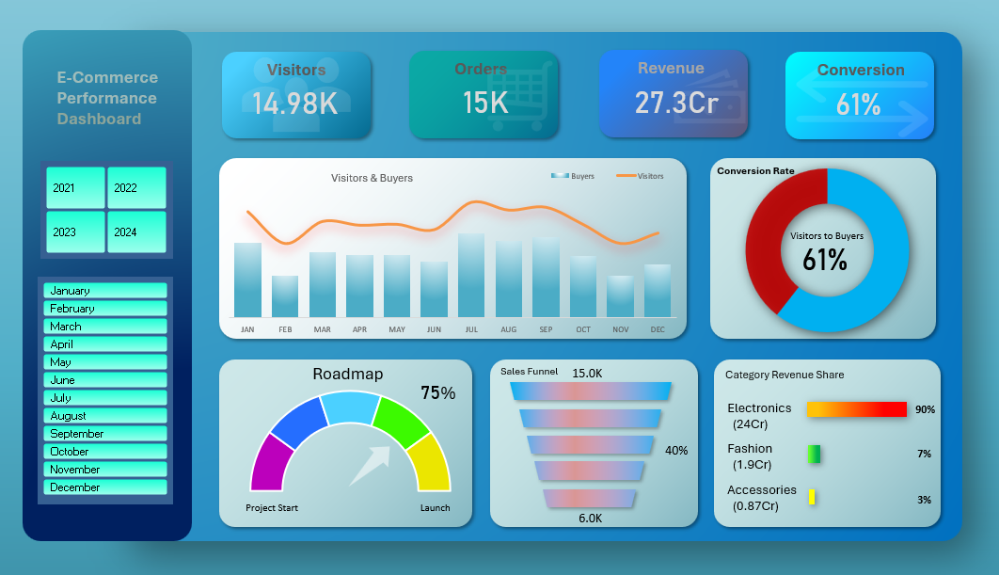

# E-Commerce Performance Dashboard

## Overview

This project is an interactive **E-Commerce Performance Dashboard** built using **Microsoft Excel** to analyze business performance across customer traffic, sales, conversions, and product categories.

The dashboard provides a visual overview of key business metrics and helps identify customer behavior, sales trends, and category-level performance.

---

## Objective

The goal of this dashboard is to transform raw transactional data into meaningful business insights that support data-driven decision-making.

Key business questions addressed:

* How many visitors are converting into buyers?
* What is the overall conversion rate?
* Which product category generates the highest revenue?
* How do new and returning buyers contribute to sales?
* Where do customers drop off in the sales funnel?

---

## Tools Used

* **Microsoft Excel**

  * Pivot Tables
  * Pivot Charts
  * Slicers
  * KPI Cards
  * Conditional Formatting
  * Custom Dashboard Design

---

## Dataset

The dataset contains e-commerce transaction data including:

* Order Date
* Year / Month
* Visitors
* Buyers
* New Buyers
* Returning Buyers
* Sales Revenue
* Product Categories

---

## Key Performance Indicators (KPIs)

The dashboard tracks the following KPIs:

* **Total Revenue**
* **Total Visitors**
* **Total Orders**
* **Conversion Rate**

---

## Dashboard Components

### 1. Visitors vs Buyers Trend

A combo chart comparing monthly visitors and buyers to analyze traffic and purchase behavior.

### 2. Conversion Rate Chart

A donut chart showing visitor-to-buyer conversion performance.

### 3. Sales Funnel

Visual representation of customer drop-off across purchase stages.

### 4. Roadmap / Progress Indicator

Progress tracker showing business growth milestones.

### 5. Category Revenue Share

Shows revenue contribution from:

* Electronics
* Fashion
* Accessories

### 6. Interactive Filters

Slicers allow filtering by:

* Year
* Month

---

## Key Insights

* Conversion rate remained around **40%**
* Electronics contributed the majority of total revenue
* Revenue concentration indicates strong dependency on a single category
* Monthly traffic fluctuations impacted order volume

---

## Skills Demonstrated

This project showcases:

* Data Cleaning
* Data Transformation
* KPI Development
* Data Visualization
* Dashboard Design
* Business Insight Generation
* Excel Analytics

---

## Dashboard Preview


Example:
```
## Dashboard Preview


```

---

## Future Improvements

Potential enhancements:

* Add profit margin analysis
* Add customer segmentation
* Add regional sales comparison
* Migrate dashboard to Power BI/Tableau

---

## Author

**[Ebin Joshy]**
Aspiring Data Analyst | Excel | SQL | Python | Data Visualization
